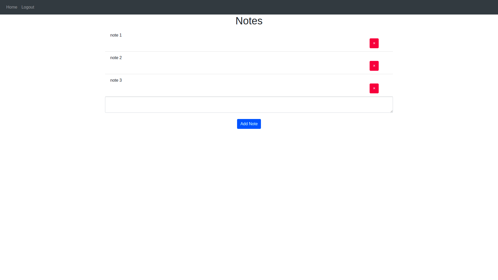
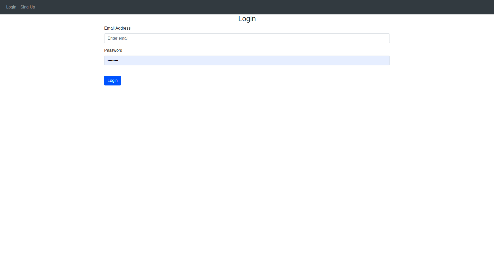
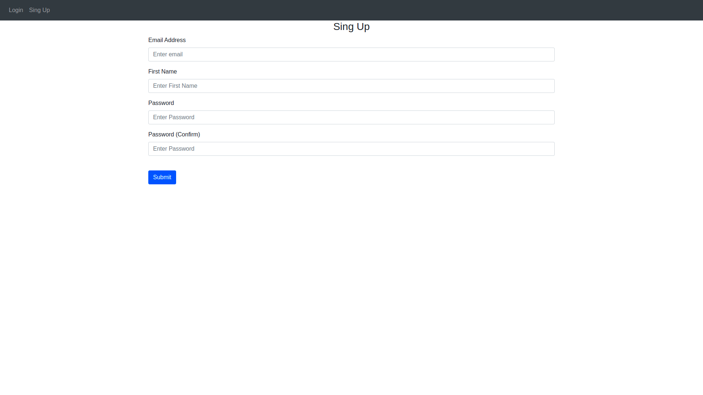

<h1>Web app com flask - Notes</h1>

 
<h2 align="center">About</h2>

This project is an app that can storege notes. You can either delete or create new notes.
you will need an account to access the webapp and your notes, so there is a sing-up page. 
Created using Flask and Bootstrap.

<h2>Requirements</h2>
  
<ul>
	<li>Flask</li>
  <li>Python</li>
  <li>SQLAlchemy</li>
</ul>

<h2 align="center">
  Project Printscreen 
</h2>
 
<h1>
	
	
	
</h1>
